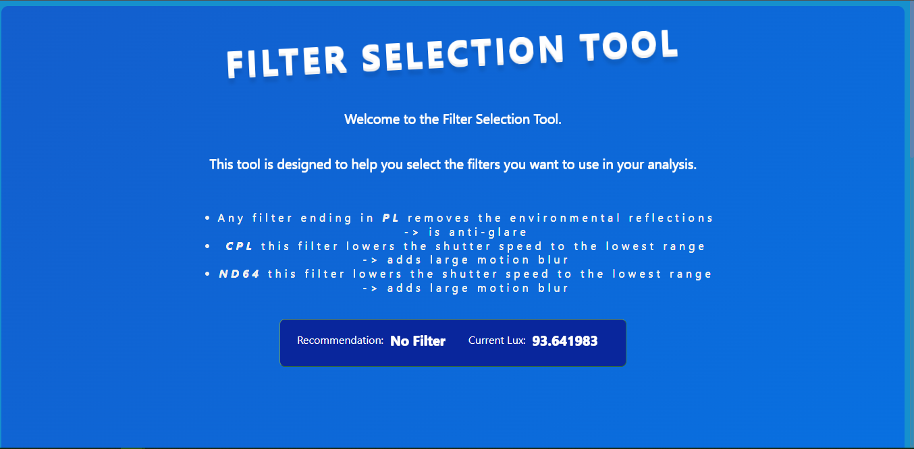

# ND_Filter_Selection

An ESP32 Lux sensor for selecting the right Optical Lens filter

This project is a simple ESP32 device that can be used to select the right filter for your camera sensor.

The inspiration for this project came about as i needed an automated way to select the right filter for my [Parrot Anafi](https://www.parrot.com/en/drones/anafi), based on environmental conditions.

This project uses a very simple algorithm to select the right filter, input data is collected using an `LDR sensor` and the filter is selected based on the average value of the input relative to a known `Lux` map of sunlight values. It is not the most accurate thing in the world, but is accurate enough to be useful for ameture cinematography.

To setup the project, you need to install the following packages:

- [VSCode](https://code.visualstudio.com/download)
- [Platformio](https://platformio.org/)

You then need to buy an LDR Sensor and an ESP32.

Out of the box the `LDR` is connected to the `GPIO33` pin with a `10k` resistor as the reference resistance. These settings can be changed in the `.ino` file.

If you have any issues, please open an issue. If you have any questions, please ask in the discussions section.

